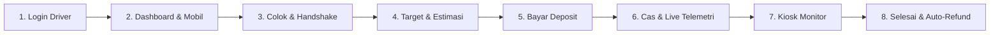
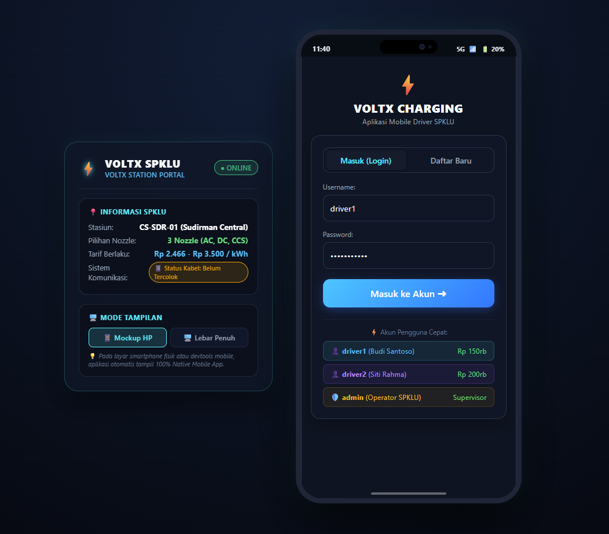
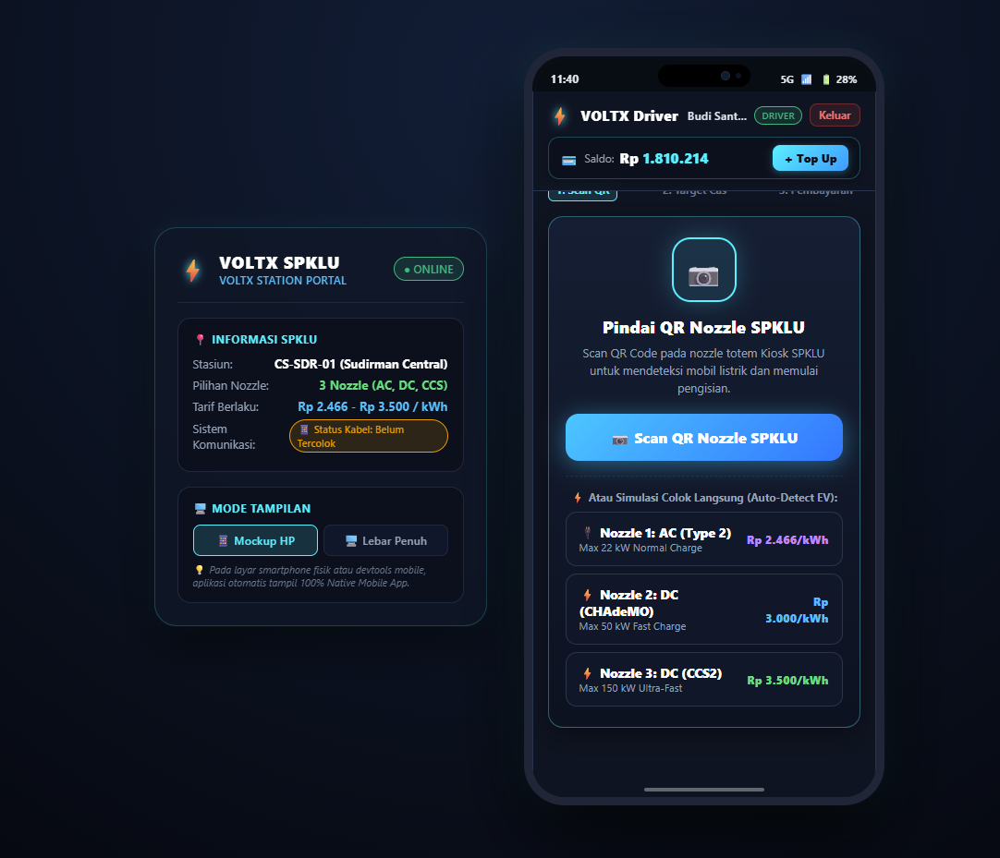
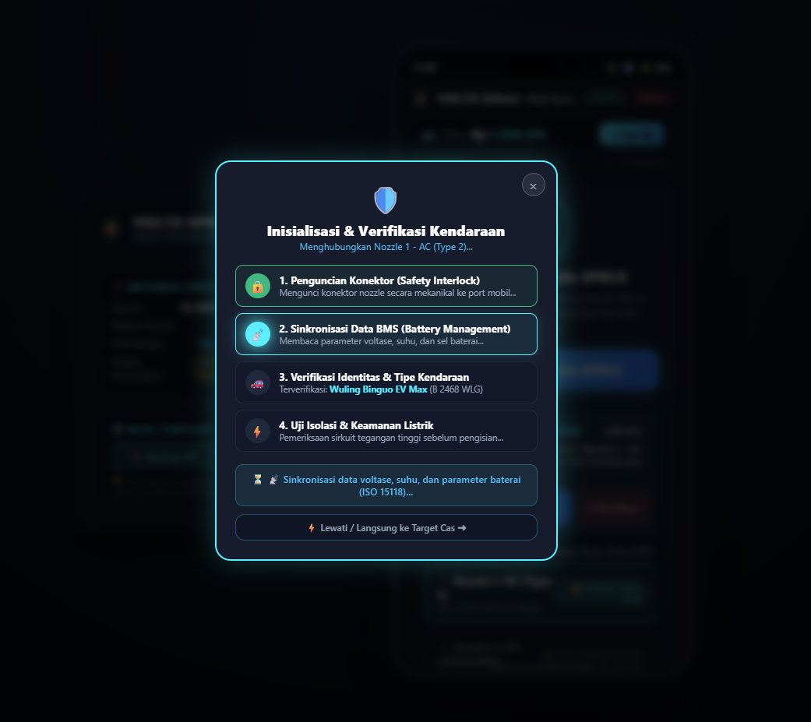
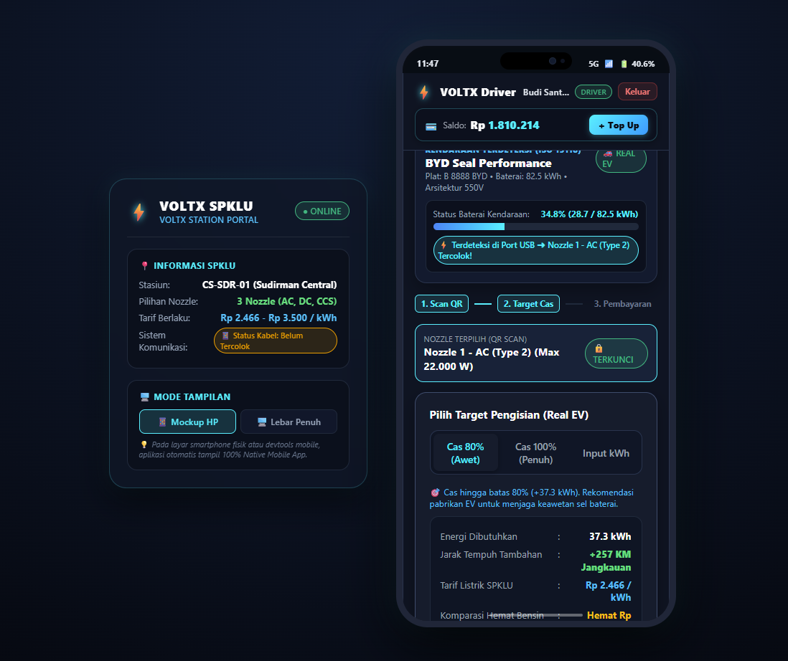
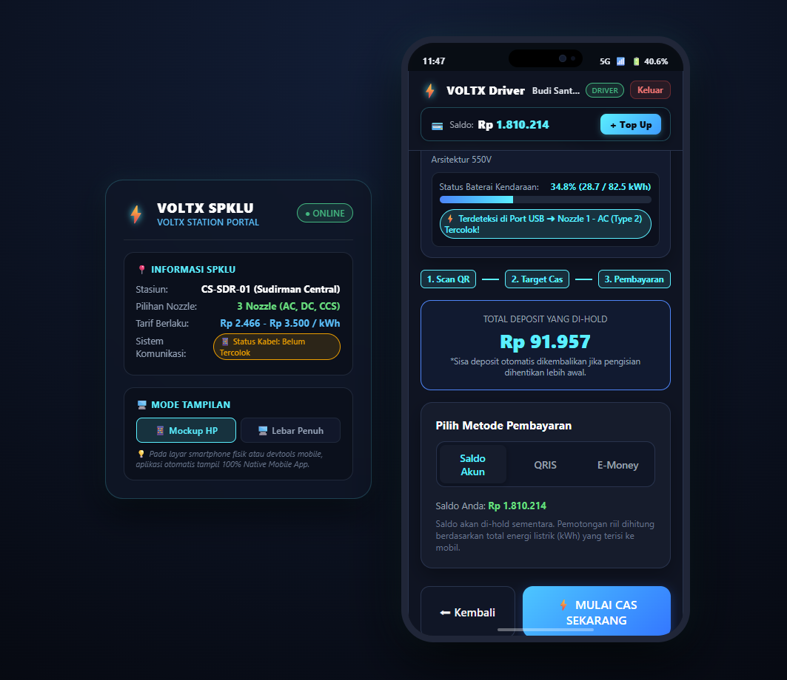
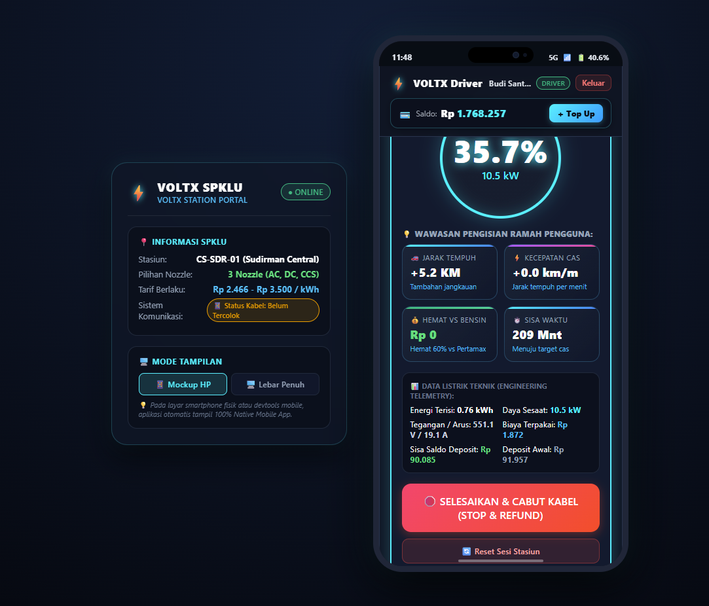
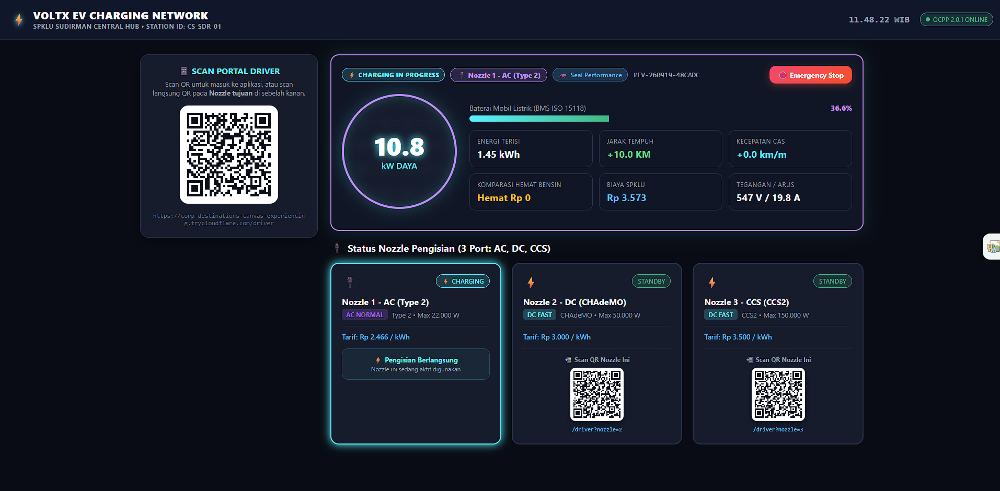
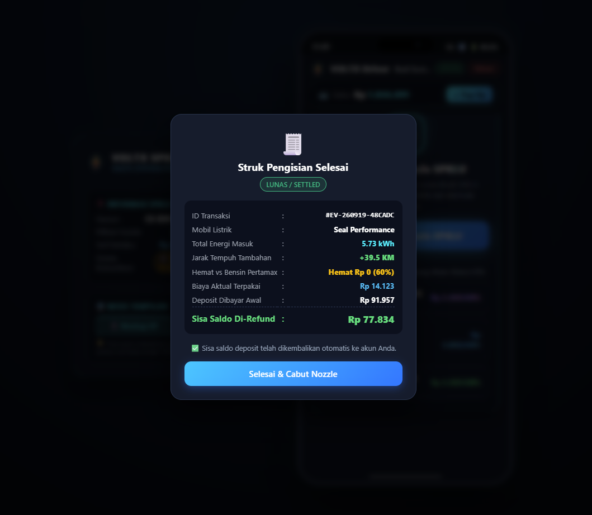

# ⚡ VOLTX — EV Charging Station Simulator (SPKLU)

[](https://www.python.org/)
[](https://fastapi.tiangolo.com/)
[](https://www.sqlalchemy.org/)
[](https://docs.pydantic.dev/)
[](https://websockets.readthedocs.io/)
[](#-arsitektur-sistem--clean-code)
[](#-alur-pengguna--tampilan-antarmuka-user-journey--mockup-ui)
[](#-pengujian-automated-tests)

Sistem simulasi **Stasiun Pengisian Kendaraan Listrik Umum (SPKLU / EVCS)** interaktif berbasis Python yang menerapkan standar **Clean Code** dan **Clean Architecture**.

Dirancang fleksibel: dapat dijalankan **100% simulasi (Pure Software Simulation)** maupun dihubungkan dengan **perangkat keras riil (Hardware Mode)**:
- **💻 Laptop (Kiosk Screen - `/kiosk`)**: Menampilkan visual layar fisik totem mesin SPKLU interaktif, QR Code stasiun dinamis, status 3 nozzle pengisian (AC, DC, CCS), live telemetry gauge (Watt, Volt, Ampere, Suhu, RPM), dan sensor simulasi tap kartu RFID.
- **📱 HP / Smartphone (Driver App - `/driver`)**: Dibuka melalui browser smartphone pengemudi untuk scan nozzle SPKLU, memilih target cas mobil listrik (Full 100% / Target SoC Kustom / Manual kWh), memilih pembayaran deposit (In-App Wallet, QRIS Dinamis, E-Money Tap), memantau charging secara live, serta tombol **"Stop & Auto-Refund"**!

---

## 🛠️ Tech Stack yang Digunakan

Sistem ini dibangun dengan stack teknologi modern, ringan, dan tanpa dependensi eksternal yang rumit:

### 1. Backend & API
- **[Python 3.10+](https://www.python.org/)**: Bahasa pemrograman utama yang modular dan type-annotated.
- **[FastAPI](https://fastapi.tiangolo.com/)**: Web framework asinkron berkecepatan tinggi dengan integrasi OpenAPI/Swagger dan *Lifespan Application Lifecycle*.
- **[Uvicorn](https://www.uvicorn.org/)**: ASGI Web Server performa tinggi dengan dukungan penuh HTTP/1.1 dan WebSockets.
- **[WebSockets](https://websockets.readthedocs.io/)**: Protokol komunikasi full-duplex dua arah untuk streaming telemetri pengisian daya secara *real-time* ke Kiosk dan Driver.
- **[SQLAlchemy 2.0](https://www.sqlalchemy.org/)**: ORM modern berbasis `DeclarativeBase` dengan transaksi database ACID, session dependency injection, dan skema migrasi otomatis.
- **[Pydantic V2](https://docs.pydantic.dev/)**: Validasi skema DTO (*Data Transfer Object*), request/response parsing dengan `ConfigDict(from_attributes=True)`.
- **Database**:
  - **SQLite (WAL Mode)**: Default database lokal dengan *Write-Ahead Logging* (`PRAGMA journal_mode=WAL`), *synchronous=NORMAL*, dan *busy_timeout* untuk kehandalan konkurensi tinggi.
  - **PostgreSQL**: Didukung penuh untuk deployment cloud (Render / VPS) via `psycopg2-binary`.
- **[Jinja2](https://jinja.palletsprojects.com/)**: Template engine untuk merender antarmuka web Kiosk dan Driver secara server-side.
- **[qrcode](https://pypi.org/project/qrcode/)**: Library pembuat QR Code dinamis untuk terminal konsol dan interface stasiun.

### 2. Frontend & User Interface
- **HTML5 & Modern CSS3**: Desain antarmuka bertema *EV Neon Dark Theme* yang estetik, responsif, dan ramah pengguna.
- **Vanilla JavaScript (ES6+)**: Komunikasi asinkron (`fetch` API), klien WebSocket bawaan browser, dan manipulasi DOM tanpa beban framework berat (Zero-build, loading instan).
- **SVG & Canvas Telemetry**: Animasi jarum speedometer daya (Watt), indikator persentase SoC baterai, dan visualisasi status nozzle.

### 3. Hardware & OS Integration (Opsional)
- **[Android Debug Bridge (ADB)](https://developer.android.com/tools/adb)**: Komunikasi hardware untuk membaca data fisik baterai smartphone (level, voltase, suhu, status pengisian via `dumpsys battery`).
- **Windows Registry (`winreg`)**: Pemetaan hardware port USB fisik laptop (`Port_#0002.Hub_#0001`) ke Nozzle 1, 2, atau 3.
- **[Cloudflare Tunnel (`cloudflared`)](https://developers.cloudflare.com/cloudflare-one/connections/connect-networks/)**: Akses publik HTTPS/WSS instan tanpa perlu IP publik atau port forwarding.

### 4. Testing & DevOps
- **Python `unittest`**: Framework pengujian bawaan dengan in-memory SQLite untuk pengujian terisolasi dan cepat.
- **Docker**: Containerization aplikasi berbasis multi-stage Dockerfile untuk kemudahan deployment di berbagai cloud provider.

---

## 🏛️ Arsitektur Sistem & Clean Code

Proyek ini telah direfaktor secara ketat mengikuti prinsip **Clean Architecture** dan **Clean Code Python**:

```
charging-station/
├── app/
│   ├── core/                  # Core Layer: Framework-agnostic
│   │   ├── config.py          # Konfigurasi aplikasi & path direktori terpusat
│   │   └── exceptions.py      # Domain Exceptions murni (NotFoundError, ValidationError, dll)
│   ├── database.py            # Database Layer: SQLAlchemy 2.0 engine & session lifecycle
│   ├── models.py              # Domain Entities: ORM models (User, Vehicle, Station, Session, dll)
│   ├── schemas.py             # DTO Layer: Pydantic V2 schemas (ConfigDict, model_dump)
│   ├── services/              # Use Cases / Application Business Rules Layer
│   │   ├── billing_service.py # Logika perhitungan biaya, deposit hold, dan settlement refund
│   │   ├── charging_engine.py # Simulasi aliran daya, handshake ISO 15118, telemetri live
│   │   ├── station_manager.py # Manajemen state stasiun dan penguncian nozzle
│   │   ├── adb_battery.py     # Background hardware polling baterai via ADB
│   │   └── port_mapper.py     # Resolusi hardware port USB fisik ke nozzle SPKLU
│   ├── routers/               # Interface Adapters / Web Presentation Layer
│   │   ├── api_auth.py        # REST API: Autentikasi, profil, wallet, kendaraan, kartu RFID
│   │   ├── api_station.py     # REST API: Status stasiun, nozzle, session control, kalibrasi
│   │   └── ws_charging.py     # WebSockets: Telemetri broadcast live streaming
│   └── main.py                # Composition Root: FastAPI application dengan modern lifespan
├── static/                    # Asset statis: CSS gaya neon & JavaScript UI
├── templates/                 # Template HTML: Kiosk Totem & Driver Mobile Web App
├── tests/                     # Test Suite: 39 Unit Tests otomatis
├── calibrate_ports.py         # CLI Tool kalibrasi port USB laptop interaktif
├── run.py                     # Launcher server lokal dengan cetak QR terminal
└── run_tunnel.py              # Launcher public Cloudflare Tunnel (HTTPS/WSS)
```

### Karakteristik Clean Code yang Diterapkan:
1. **Pemisahan Tanggung Jawab (*Separation of Concerns*)**: Lapisan *Service* tidak lagi bergantung pada framework web FastAPI (`HTTPException`). Service melempar *Domain Exceptions* murni.
2. **Bebas Side-Effect saat Import**: Pembuatan tabel, migrasi database, data seeding, dan background worker hanya berjalan saat aplikasi startup di dalam `lifespan(app)`.
3. **Bebas Dead Code**: Seluruh fungsi dan file yang tidak digunakan telah dibersihkan secara tuntas.
4. **Idempoten & Non-Mutating**: Operasi kalkulasi murni tidak memutasi entity input, dan query read `GET` tidak melakukan mutasi database.

---

## ⚡ Fitur Utama Sistem

1. **3 Pilihan Nozzle Pengisian Standar Industri**:
   - **Nozzle 1 — AC Normal (22.000 W / Type 2)**: Tarif Rp 2.466 / kWh
   - **Nozzle 2 — DC Fast (50.000 W / CHAdeMO)**: Tarif Rp 3.000 / kWh
   - **Nozzle 3 — DC Ultra-Fast (150.000 W / CCS2)**: Tarif Rp 3.500 / kWh
2. **Simulasi Kendaraan Listrik Riil (EV Fleet Pool)**:
   - Mendukung profil mobil listrik populer di Indonesia: **Hyundai Ioniq 5 (800V)**, **Wuling Binguo EV**, **BYD Seal**, **Tesla Model 3**, dan **Chery Omoda E5**.
   - Dilengkapi kurva penurunan daya otomatis (*CC-CV Tapering Curve*) di atas SoC 80% untuk melindungi sel kimia baterai (*Battery Health Protection*).
3. **Sinkronisasi Real-Time Dua Arah (WebSockets)**:
   - Ketika nozzle dicolokkan ke mobil listrik (atau simulasi colok nozzle), layar Kiosk seketika menampilkan status **🔌 KABEL TERCOLOK**.
   - Ketika pengisian dimulai, jarum meter daya (kW), tegangan (Volt), arus (Ampere), dan metrik ramah pengguna (jarak tempuh KM, penghematan BBM) bergerak sinkron antara layar Kiosk dan HP Pengemudi.
4. **Multi-Metode Pembayaran**:
   - **Saldo Dompet (In-App Wallet)**: Saldo awal sudah disiapkan untuk demo pengujian, dilengkapi fitur `+ Top-Up`.
   - **QRIS Dinamis**: Menghasilkan barcode QRIS sesuai estimasi nominal daya.
   - **E-Money / Tap Kartu RFID**: Pop-up interaktif simulasi tap kartu BCA Flazz / Mandiri E-Money.
5. **Penghentian di Tengah Jalan & Auto-Refund Seketika**:
   - Pengguna dapat menekan tombol **"Stop Charging"** kapan saja atau mencabut kabel fisik USB.
   - Sistem seketika menghentikan aliran listrik, menghitung biaya kWh riil yang masuk, dan **mengembalikan sisa uang deposit secara instan** ke akun pengguna!

---

## 📸 Alur Pengguna & Tampilan Antarmuka (User Journey & Mockup UI)

Sistem ini mensimulasikan alur pengisian kendaraan listrik (EV) secara menyeluruh dari autentikasi awal hingga struk pelunasan otomatis:



### Galeri Tangkapan Layar & Alur Interaksi:

| **1. Halaman Login Driver / Operator** | **2. Dashboard Utama Driver** |
| :---: | :---: |
|  |  |
| Masuk ke sistem dengan opsi *Quick Demo Login* (`driver1`, `driver2`, `admin`) tanpa perlu mengetik manual saat pengujian. | Memantau profil mobil listrik, status stasiun terdekat, kartu RFID/Flazz terdaftar, dan saldo dompet (*In-App Wallet*). |

| **3. Verifikasi Keselamatan (Handshake ISO 15118)** | **4. Pemilihan Target Pengisian** |
| :---: | :---: |
|  |  |
| Protokol 4 tahap keselamatan: *Mechanical Safety Lock*, Sinkronisasi BMS CAN-Bus, Identifikasi Kendaraan, dan Uji Isolasi Listrik. | Pilihan target pengisian (80% Rekomendasi Pabrikan / 100% Penuh / Manual kWh) lengkap dengan kalkulasi komparasi hemat bensin Pertamax. |

| **5. Konfirmasi Pembayaran & Hold Deposit** | **6. Live Telemetri Pengisian (Driver App)** |
| :---: | :---: |
|  |  |
| Pilih metode pembayaran deposit awal: Saldo Akun (*Hold*), QRIS Dinamis, atau Tap Kartu E-Money/RFID dengan proteksi saldo. | Pemantauan daya aktif (Watt), tegangan (Volt), arus (Ampere), suhu (°C), kenaikan jarak tempuh (KM), dan tombol stop darurat. |

| **7. Layar Totem Mesin SPKLU (Kiosk Laptop)** | **8. Struk Pelunasan & Auto-Refund** |
| :---: | :---: |
|  |  |
| Tampilan layar fisik totem SPKLU di laptop yang memvisualisasikan status 3 nozzle serentak dan live gauge saat mobil mengecas. | Sesi selesai: biaya riil dihitung berdasarkan kWh masuk, dan sisa saldo deposit langsung di-refund seketika ke akun pengguna! |

---

## 🚀 Panduan Menjalankan

### Persiapan Awal
Pastikan Python 3.10 atau versi yang lebih baru telah terinstal:
```bash
python --version
```
Pasang seluruh dependensi:
```bash
pip install -r requirements.txt
```

---

### Mode 1: Jalankan di Jaringan Lokal (Satu Wi-Fi)
Gunakan mode ini jika Laptop dan HP berada di satu jaringan Wi-Fi / Hotspot yang sama:
```bash
python run.py
```
Terminal akan langsung menampilkan:
- **Layar Kiosk Laptop**: `http://localhost:8000/kiosk` (Buka di browser laptop, disarankan tekan F11 / Fullscreen)
- **Aplikasi Driver HP**: `http://<IP_LAPTOP>:8000/driver`
- **QR Code Terminal**: Arahkan kamera smartphone ke terminal untuk langsung membuka aplikasi!

---

### Mode 2: Jalankan via Cloudflare Public Tunnel (Internet Publik)
Gunakan mode ini jika HP menggunakan paket data seluler (4G/5G) atau ingin diakses dari luar jaringan Wi-Fi:
```bash
python run_tunnel.py
```
Script akan otomatis mengunduh `cloudflared` (jika belum ada), menyalakan server, dan menampilkan URL publik HTTPS/WSS beserta QR Code di terminal.

---

### Mode 3: Kalibrasi Port USB Hardware (Opsional)
Jika ingin menghubungkan kabel data HP ke port USB laptop tertentu:
```bash
# Tampilkan daftar mapping port saat ini
python calibrate_ports.py --list

# Kalibrasi interaktif
python calibrate_ports.py
```

---

## 🧪 Pengujian (Automated Tests)

Proyek ini dilengkapi test suite komprehensif menggunakan Python `unittest`. Seluruh 39 pengujian mencakup autentikasi, isolasi sesi, billing refund, kurva simulasi EV, integrasi ADB, dan port mapper.

Jalankan seluruh pengujian:
```bash
python -m unittest discover tests
```

### Hasil Pengujian:
```text
.......................................
----------------------------------------------------------------------
Ran 39 tests in 1.370s

OK
```

---

## 📚 Panduan & Dokumentasi Tambahan

- [**USER_GUIDE.md**](USER_GUIDE.md): Panduan lengkap penggunaan aplikasi untuk Driver dan Operator SPKLU.
- [**PRD.md**](PRD.md): Dokumen Product Requirements Document & spesifikasi rumus matematis sistem.
- [**SETUP_DEMO_LAPTOP_LAIN.md**](SETUP_DEMO_LAPTOP_LAIN.md): Panduan cepat membawa simulator untuk demo di laptop lain / saat presentasi.
- [**CARA_PAKAI_CLOUDFLARE_TUNNEL.md**](CARA_PAKAI_CLOUDFLARE_TUNNEL.md): Panduan teknis penggunaan Cloudflare Tunnel.

---

## 📄 Lisensi
Proyek ini dibuat untuk keperluan edukasi dan simulasi sistem stasiun pengisian kendaraan listrik modern.
